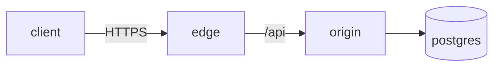
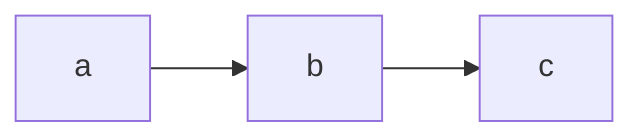

# fin.blog post authoring

This skill captures the exact conventions the fin.blog renderer (`app.js` +
`styles.css`) expects. Follow it and a fresh markdown file plus a one-line
`posts/index.json` patch are everything needed to publish.

## 1. File location and naming

```
posts/<id>-<slug>.md
```

- `<id>`: hex incremented from the latest post in `posts/index.json`, e.g.
  current top is `0x06`, next is `0x07`. Keep the `0x` prefix, two hex
  digits, lowercase.
- `<slug>`: lowercase kebab-case, ASCII only, no leading/trailing dash.
  Used in the URL fragment (`#/<slug>`) and the reader crumb.
- File extension `.md`. UTF-8, LF line endings.

The renderer fetches the file at `posts/<id>-<slug>.md`, so the two
fields **must** match the filename exactly.

## 2. YAML frontmatter (required)

Every post starts with a `---` block. All fields are required except
`severity`, which may be `null` for journal-style posts.

```markdown
---
id: "0x07"
slug: "new-post-slug"
title: "Title shown on the card and in the reader header"
kind: "WRITEUP"
tags: ["netsec", "tag2", "tag3"]
date: "2026.06.01"
read: "8 min"
severity: "HIGH"
excerpt: "One-line teaser shown on the card and at the top of the reader."
---
```

### Field rules

| Field      | Type            | Allowed values / shape                                       |
|------------|-----------------|--------------------------------------------------------------|
| `id`       | string          | Must match filename `<id>`. Quoted to preserve `0x`.         |
| `slug`     | string          | Must match filename `<slug>`. Quoted.                        |
| `title`    | string          | Up to ~70 chars reads cleanly on the card. Sentence case.    |
| `kind`     | string          | `"WRITEUP"` or `"JOURNAL"`. Drives the kind chip color.      |
| `tags`     | string[]        | 2–4 short lowercase tags. No `#`, no spaces, kebab if multi. |
| `date`     | string          | `YYYY.MM.DD`. Dot separators. Used for sort and display.     |
| `read`     | string          | `"N min"` (rough estimate). Shown on the card and reader.    |
| `severity` | string \| null  | `"CRITICAL"`, `"HIGH"`, `"MEDIUM"`, or `null`. Writeups only.|
| `excerpt`  | string          | One sentence. Shown on the card body and reader subhead.     |

### Severity guidance (writeups)

- `CRITICAL` — RCE, auth bypass, full data exfil, firmware backdoor.
- `HIGH` — privilege escalation, broad credential theft, root-as-user.
- `MEDIUM` — SSRF, stored XSS, single-account compromise, info leak.
- `null` — journals, opinion, retros — anything not a security finding.

### Kind guidance

- `WRITEUP` — technical: bugs, audits, reversing, infra notes. Use
  `### // Section` headers, code, mermaid, callouts. Bias to short
  declarative paragraphs.
- `JOURNAL` — personal: process, freelance, tools, life. Section
  headers optional. Looser cadence, but still no fluff.

## 3. Section style

The site's visual identity comes from `### // ALL_CAPS_OR_PHRASE` headers.
**Keep the leading `//`** — it's part of the style and is rendered as plain
text (it is not a comment to strip).

```markdown
### // The setup

Body paragraph.

### // The chain

Body paragraph.

### // The fix

Body paragraph.
```

Use `h3` (`###`) for sections. Do not use `h1` (the title is already in
the reader head) or `h2`.

Recommended writeup skeleton:

```
### // The setup       (target, surface, what you were looking at)
### // The bug         (root cause, in two paragraphs max)
### // The chain       (attack path; diagram if it helps)
### // The payload     (concrete exploit, code/curl/etc.)
### // The fix         (mitigation, disclosure, timeline)
```

Journals don't need a skeleton. One header per "beat" of the post.

## 4. Code blocks

Triple-backtick fenced blocks. Language tag optional — the renderer adds
the yellow `// CODE` chip regardless. Use a language tag for syntax
intent only (browser highlighting is not currently wired).

````markdown
```
POST /profile/generate
username=fin%0Ascript-security%202%0Aup%20/tmp/x.sh%0A
```

```python
def vulnerable(user_input):
    return os.system(user_input)
```
````

Inline code with single backticks: `` `script-security 2` ``.

Wrap long lines yourself; the reader scrolls horizontally on `pre` but
that's a last resort.

## 5. Mermaid diagrams

Fence with the `mermaid` language tag. The renderer swaps the block for
a styled SVG (magenta `// DIAGRAM` chip, CP-yellow node borders, dark
background) at parse time.

````markdown

````

All Mermaid diagram types are available: `flowchart`, `sequenceDiagram`,
`classDiagram`, `stateDiagram-v2`, `erDiagram`, `gantt`, `pie`. Keep
diagrams under ~12 nodes for legibility. Use diagrams when the chain or
data flow is the point of the post — not as decoration.

Test the syntax in the Mermaid Live Editor (mermaid.live) before
committing if you're not sure.

## 6. Voice / tone

Match the existing posts (`0x01` … `0x06`):

- Short declarative sentences. Trim qualifiers ("basically", "really",
  "just"). Cut "I think" — say the thing.
- Lead with the bug, then the chain, then the fix. No 800-word preambles.
- Concrete > abstract. Name files, ports, functions, payloads. "It was
  vulnerable" is weak; "The username field accepts newlines and the
  Jinja2 template doesn't escape them" is the post.
- Cyberpunk vocabulary is fine in small doses (corpo, netrunner,
  off-grid, blackwall) — don't lean on it to do the work. Substance
  carries the aesthetic; aesthetic without substance is cosplay.
- Disclose timelines plainly: "Disclosed Tuesday. Patch Thursday."
- One-line landing for journals — give the reader something to chew on
  in the last sentence. No moralizing.

## 7. Update `posts/index.json`

The card list reads from `posts/index.json`, not from the filesystem.
A markdown file without an `index.json` entry will not appear.

Add a new object at the top of the array with **the same fields** as the
frontmatter (minus the document body). The client sorts by `date`
descending, so position in the array doesn't strictly matter, but
prepending keeps diffs readable.

```json
{
  "id": "0x07",
  "slug": "new-post-slug",
  "title": "Title shown on the card and in the reader header",
  "kind": "WRITEUP",
  "tags": ["netsec", "tag2", "tag3"],
  "date": "2026.06.01",
  "read": "8 min",
  "severity": "HIGH",
  "excerpt": "One-line teaser shown on the card and at the top of the reader."
}
```

Keep the trailing-comma rules valid JSON — no comments, no trailing
commas. A bad `index.json` silently breaks the whole list.

## 8. Local preview

```
python3 -m http.server 8080
# http://localhost:8080
```

Open the new post via the list or directly at `#/<slug>`. Check:

- Card renders with the correct kind chip and severity badge.
- Title doesn't wrap awkwardly on the card.
- Excerpt clamps cleanly (no orphan word on a new line if avoidable).
- Section headers render with the `//` prefix.
- Code blocks show the yellow `// CODE` chip.
- Mermaid diagrams render as SVG (not as raw code) with the magenta
  `// DIAGRAM` chip.
- Reader scrolls past the fold.
- Hash route works: reloading on `#/<slug>` reopens the post.

## 9. Commit + deploy

```
git add posts/<id>-<slug>.md posts/index.json
git commit -m "Add 0x07: <short title>"
git push
```

GitHub Pages picks up `main` automatically (Settings → Pages → Deploy
from a branch → `main` / `/`). Build time is ~30–60 s after push.

`.nojekyll` is already in the repo root, so Pages serves files raw —
the `posts/` folder is publicly readable, which is intentional (the
client fetches them).

## 10. Checklist (before committing)

- [ ] Filename `posts/<id>-<slug>.md` matches `id` and `slug` in frontmatter.
- [ ] `id` is the next hex after the previous top entry.
- [ ] `date` is `YYYY.MM.DD`.
- [ ] `kind` is `WRITEUP` or `JOURNAL`.
- [ ] `severity` set for writeups, `null` for journals.
- [ ] `excerpt` is one sentence and reads cleanly on the card.
- [ ] Section headers use `### // …`.
- [ ] Mermaid blocks render as SVG locally.
- [ ] `posts/index.json` has a matching entry.
- [ ] `posts/index.json` is still valid JSON (`python3 -m json.tool < posts/index.json`).
- [ ] Local server preview looks right on desktop and at 720px width.

## 11. Common mistakes

- Forgetting to update `index.json` → the file exists but never appears.
- Using `##` headers → too large, breaks the visual rhythm. Use `###`.
- Dropping the `//` prefix on section headers → still works but loses
  the look. Keep it.
- Writing `severity: HIGH` (unquoted) instead of `"HIGH"` → YAML accepts
  it but be consistent with quoting in frontmatter.
- Adding a trailing comma to `index.json` → JSON parse error, entire
  list shows `NO_MATCH`.
- Slug with spaces or uppercase → URL fragment breaks.
- Using a tag like `"DNS Rebinding"` → tags render lowercase with a
  leading `#`. Keep them short and lowercase.

## 12. Quick-start template

Copy this into `posts/0x<NN>-<slug>.md`:

```markdown
---
id: "0x07"
slug: "your-slug"
title: "Your title here"
kind: "WRITEUP"
tags: ["tag1", "tag2"]
date: "2026.06.01"
read: "8 min"
severity: "HIGH"
excerpt: "One-line teaser."
---

Opening line — what this post is about, in one sentence.

### // The setup

Context. The target, the surface, what you were looking at.

### // The bug

Root cause in two paragraphs max. Name the function, file, or
configuration.

### // The chain



Walk-through of the attack or the failure mode.

### // The payload

```
concrete exploit here
```

### // The fix

What was changed. Disclosure timeline. One landing sentence.
```

And the matching `posts/index.json` head:

```json
{
  "id": "0x07",
  "slug": "your-slug",
  "title": "Your title here",
  "kind": "WRITEUP",
  "tags": ["tag1", "tag2"],
  "date": "2026.06.01",
  "read": "8 min",
  "severity": "HIGH",
  "excerpt": "One-line teaser."
}
```
