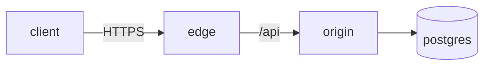

# fin.blog

Static personal blog with a Cyberpunk 2077 HUD aesthetic. No build step, no
runtime React, no framework — just `index.html` + `styles.css` + `app.js` and a
folder of markdown.

## Run locally

The page fetches `posts/index.json` and `posts/*.md`, so it needs to be served
over HTTP (opening `index.html` directly via `file://` will fail on the
fetches). Any static server works:

```
python3 -m http.server 8080
# then open http://localhost:8080
```

## Deploy on GitHub Pages

1. Push to the `main` branch of any repo.
2. Settings → Pages → Source: `Deploy from a branch` → `main` / `/ (root)`.
3. Visit `https://<username>.github.io/<repo>/` (or the user-site URL).

The `.nojekyll` file in the root keeps Pages from preprocessing.

## Add a post

Full authoring guide — frontmatter schema, section style, mermaid usage,
voice, checklist — lives at
[`.claude/skills/fin-blog-post/SKILL.md`](.claude/skills/fin-blog-post/SKILL.md).
Quick version:

1. Create `posts/<id>-<slug>.md` with YAML frontmatter:

   ```markdown
   ---
   id: "0x07"
   slug: "my-new-post"
   title: "Title goes here"
   kind: "WRITEUP"            # WRITEUP | JOURNAL
   tags: ["netsec", "tag2"]
   date: "2026.06.01"
   read: "8 min"
   severity: "HIGH"           # CRITICAL | HIGH | MEDIUM | null
   excerpt: "One-line teaser shown on the card and at the top of the reader."
   ---

   Body in markdown. Use `### // Section` for section headers — keep the
   leading `//`, it's part of the visual style.

   ```
   fenced code blocks render with the // CODE flag
   ```
   ```

2. Add the same metadata entry to `posts/index.json`. The client sorts by
   `date` descending, so order in the file doesn't matter.
3. Commit and push.

## File layout

```
/
├── index.html
├── styles.css
├── app.js
├── posts/
│   ├── index.json
│   ├── 0x01-three-years-out.md
│   ├── 0x02-dns-rebinding-returns.md
│   ├── 0x03-week-in-tmux.md
│   ├── 0x04-secure-chat-firmware.md
│   ├── 0x05-analog-notes.md
│   └── 0x06-openvpn-config-injection.md
├── assets/
│   └── favicon.svg
├── .nojekyll
└── README.md
```

## Dependencies

Loaded at runtime from CDN; no install step:

- Google Fonts: Chakra Petch, Rajdhani, JetBrains Mono
- [marked](https://github.com/markedjs/marked) v13 — markdown → HTML
- [mermaid](https://github.com/mermaid-js/mermaid) v11 — diagrams from `mermaid` fenced blocks

## Mermaid diagrams

Fence a block with the `mermaid` language tag in any post:

````markdown

````

The renderer swaps the fenced block for an inline SVG with a magenta
`// DIAGRAM` chip. Flowchart, sequence, class, state, ER, gantt, and pie
diagrams are all supported.

## Layout chrome

Three independently-collapsible regions on desktop:

- **Sidebar** — `«` / `»` chip on its right edge (or `[` key) collapses to a
  56px rail showing only nav IDs. Persists as `fin.sidebarCollapsed` in
  `localStorage`.
- **Post list** — `FOCUS` / `LIST` button on the topbar (or `]` key) hides the
  list so the reader takes the full panel. Auto-enters focus on card click and
  auto-exits on `Esc` / `CLOSE` / any nav-filter click.
- **Splitter** — 6px draggable column between list and reader. Drag to resize
  between 280–560px. Double-click resets to 360px. Persists as `fin.listWidth`.

## Keyboard

| Key   | Action                                     |
|-------|--------------------------------------------|
| `Esc` | Close reader (or mobile drawer if open)    |
| `[`   | Toggle sidebar collapse                    |
| `]`   | Toggle list visibility (focus mode)        |

`[` / `]` are ignored while a text field is focused.

Permalinks: open post is reflected in the URL fragment (`#/<slug>`), so
reloading or sharing the URL restores the same view.
