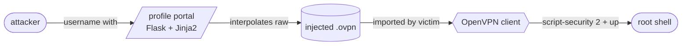

Most corpo VPN clients trust the config file more than the user. That's the bug. Not a CVE, not a zero-day — just trust radiating outward from a server nobody patched since the IPO.

### // The setup

The target distributes per-user ovpn profiles via an authenticated portal. Pull your profile, drop it into the client, you're on the corp net. Standard. The portal is a thin Flask app behind nginx; the profile is templated from a Jinja2 string that interpolates the username into the X.509 subject and a routing block.

The username field accepts newlines. The template doesn't escape them. OpenVPN's config parser treats every line as a directive.

```
POST /profile/generate
username=fin%0Ascript-security%202%0Aup%20/tmp/x.sh%0A
```

### // The chain



### // The payload

OpenVPN runs the `up` script as root by default on Linux clients. The `script-security 2` directive enables user-supplied scripts. Two extra lines in the profile and every laptop that imports it executes my code at connect time.

Persistence is trivial: drop a launchd plist on macOS, a systemd unit on Linux, a scheduled task on Windows. The VPN client doesn't care. The user clicked Connect.

### // The fix

Strip control characters from every templated input. Treat config generation like SQL: parameterize, don't concatenate. Set `script-security 0` in a server-pushed config and refuse profiles that try to raise it. Sign your ovpn files and verify on import.

I disclosed Tuesday. Patch shipped Thursday. They paid the bounty in crypto, which is the kind of cyberpunk detail I'd put in a story if it didn't happen so often.
